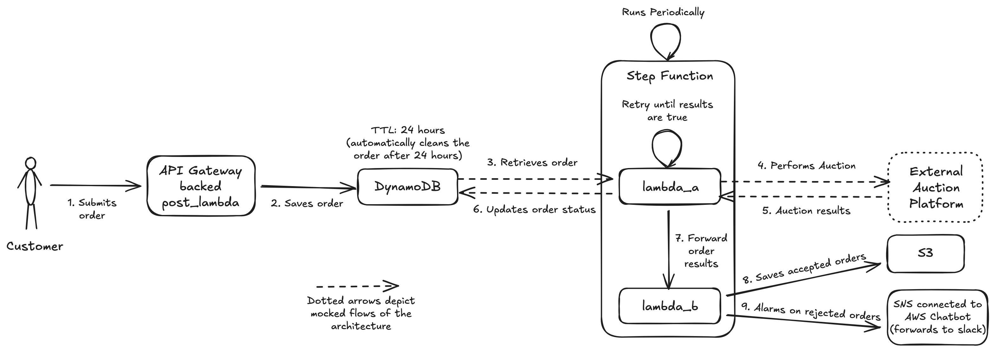

Dear Hiring Team,

Please find my solution to the take home assingment. I kept the original [READ.ME](./README.md) file intact and created this SOLUTION.md to document my solution. I started with understanding the [problem space](#problem), then [architected](#architecture) the infrastructure and then worked on completing the exercise according to the [work plan](#workplan). You can find my [solution](#solution) below.

Apologies if I missed something. I would be happy to talk about it during a follow-up call :)

Best Regard,
Ahmed

# Problem

Entrix is participating in an energy market auction. We get customer orders via a POST API ([post_lambda](./src/post_lambda/)). The post_lambda saves the orders to a database that persists the data for 24 hours. A data pipeline runs periodically which comprises of [lambda_a](./src/lambda_a/) and [lambda_b](./src/lambda_b/) -

- lambda_a (in real production scenario), 
  - retrieves the orders from the DB
  - calls the external auction platform
  - based on the results, updates the order status in DB. 
  - Then, it forwards the results to lambda_b. 
  
  In the context of this take home assignment, lambda_a mocks 
  - retrieving the orders from the DB
  - calling the external auction platform
  - updating it back in the DB.

  It simply forwards the results to lambda_b. 
  
  **Implementing all the mocked behaviour is outside the scope of this take home assignment.**

- lambda_b saves the accepted (order) results in S3 and nofities about the rejected orders to the team.

You are asked to complete the lambda code where it says "Complete the code", design the architecture and provision the infrastructure to deploy all required resources to AWS using aws-cdk for IaC (with Typescript).

# Architecture



# Workplan

## Step 1: Bootstrap the project

1. Start the skeleton of CDK stack
2. Add a Github Actions workflow to lint and test the code
3. Add a AWS CodePipeline to automatically deploy the stack to dev and prod on merge to master

## Step 2: Complete the API

1. Add the DynamoDB as the database
2. Add post_lambda in the CDK stack
3. Complete the lambda to save the data in DynamoDB
4. Hook up the post_lambda to API Gateway
5. Test the API and see if the results are saved as expected in the DynamoDB

## Step 3: Complete the data pipeline

1. Hook up lambda_a in the CDK stack
2. Add the “order-results” S3 bucket
3. Complete lambda_b to save the objects in S3
4. Create a step function to orchestrate the data pipeline

# Solution

The github repo I created during the assignment could be found here - https://github.com/mahmedk91/Entrix-Coding-Challenge

## Stack

The stack is in Typescript CDK and can be found in [infra](../infra/) folder. It deploys the stack in dev in eu-west-1 env via the deployment pipeline. It's designed to be replicable for more environments like stage or prod without requring any changes. The stack could be found [here](https://eu-west-1.console.aws.amazon.com/cloudformation/home?region=eu-west-1#/stacks/stackinfo?filteringText=&filteringStatus=active&viewNested=true&stackId=arn%3Aaws%3Acloudformation%3Aeu-west-1%3A054522428175%3Astack%2FEntrixStack%2Ffdb03fa0-020e-11f1-a19a-0294717f58a3)

The following requirements has been taken care of - 
- You are asked to provide the Infrastructure to deploy all required resources to AWS using aws-cdk for IaC (with Typescript).
- (Optional) Write tests for aws cdk constructs and ensure that the tests are executed in GitHub Actions stage.
- Everything should be deployed to *eu-west-1* region.

## Deployment Pipeline

I created a CI pipeline in Github Actions - it doesn't require any AWS credentials to run and takes care of building, linting, testing and synthesizing the stack and notifies us via Slack if it fails.

The deployment pipeline is created in AWS CodePipeline [here](https://eu-west-1.console.aws.amazon.com/codesuite/codepipeline/pipelines/Entrix-Deployment-Pipeline/view?region=eu-west-1). It does all the jobs of the CI pipeline plus the deployment of the CDK stack.

The following requirements has been taken care of - 
- Create AWS deployment Pipeline that deploys the app from a GitHub repo to our AWS account using CodePipeline (we provide the base code).
- All merges to master should automatically deploy the code to Dev environment.
- Create a simple GitHub Actions workflow to run on merge to master.
- (Optional) Write tests for aws cdk constructs and ensure that the tests are executed in GitHub Actions stage.
- (Optional) We should receive a Slack notification (don’t have to link the actual messaging app) if the Deployment Pipeline fails.
- The two pipelines exist for different purposes. They solve different problems, which helps ensure separation of concerns: GitHub Actions can handle CI tasks such as testing and linting, while CodePipeline manages AWS deployments. This separation can also improve security, since CodePipeline does not need GitHub credentials with broad repository access and can rely on native IAM roles instead. In addition, some organizations mandate AWS native tooling for production deployments to keep audit trails within CloudTrail.

## Database

I decided to go with the DynamoDB as its serverless, cheap, allows seamless integration with AWS lambda and can automatically cleanup the data via Time-to-live (TTL) feature. You can find the DynamoDB table [here](https://eu-west-1.console.aws.amazon.com/dynamodbv2/home?region=eu-west-1#table?name=orders-table-dev)

The following requirements has been taken care of - 
- The whole solution should be serverless.
- Data in the database should expire after 24 hours.

## API Lambda

I integrated the post_lambda with the API Gateway via proxy and completed the implementation to save the data to DynamoDB. I added some basic error handling in case the lambda fails. There are more improvements we can do, but I spend much time here as it was mentioned in the exercise to not modify the lambda.

You can call the POST API like this to test creating orders
```
curl -X POST https://g2kcrht3ak.execute-api.eu-west-1.amazonaws.com/dev/orders \
  -H "Content-Type: application/json" \
  -d '[
    {
      "record_id": "unique_id_1",
      "parameter_1": "abc",
      "parameter_2": 4
    },
    {
      "record_id": "unique_id_2",
      "parameter_1": "def",
      "parameter_2": 2.1
    }
  ]'
```

The following requirements has been taken care of - 
- There is an API lambda that processes POST requests and stores data in a Database.

Request body example:
` 
[ { "record_id": "unique_id_1", "parameter_1": "abc", "parameter_2": 4, },{ "record_id": "unique_id_2", "parameter_1": "def", "parameter_2": 2.1, }, ]
`

## Data Pipeline

I created the data pipeline via AWS Step functions as its a great tool to create data pipelines. Several lambdas could be orchestrated together and invoked with some glue conditional logic in between to form a chain. In our use-case we wanted to loop over lambda_a until the results were `true` and invoke lambda_b separately for each order. AWS Step Functions are really a great tool to be used in such use-cases.

The data pipeline is invoked hourly and saves the results in [order-results-dev-054522428175](https://eu-west-1.console.aws.amazon.com/s3/buckets/order-results-dev-054522428175?region=eu-west-1) S3 bucket.

### Lambda A

I just hooked up lambda_a in the CDK stack without any modifications.

The following requirements has been taken care of - 
- The Data Pipeline should be triggered by schedule and execute several lambdas in a row. Lambda A that randomly generates True/False value and returns:

```
// Lambda with ready results 
{ 
  "results": true,
  "orders": [
   { 
      "order": "accepted"
   },
   {
     "order": "rejected" 
   }
   ]
 } 
// OR 
// Lambda with results not ready 
{ 
  "results": false 
}
```
- There should be a validation of the Lambda A output checking the results field. If the results are false, Lambda A should be re-triggered until the results are true.
- Code for Lambda A, B and post has been provided. The provided Lambda code should only be completed and not modified.

### Lambda B

I completed the implementation of lambda_b to save the order in S3. Also, added lightweight error handling. There are much room for improvement, but I didn't modify the lambda as it was asked to only complete the lamda not modify it.

lambda_b was a little more special as it also mocks "requests" depedency to be packaged during the deployment. I used [aws-lambda-python-alpha](https://docs.aws.amazon.com/cdk/api/v2/docs/aws-lambda-python-alpha-readme.html) module to package it conveniently.

The following requirements has been taken care of - 
- Lambda B that gets order from the event and raised an error, if the order status is rejected. Otherwise, it should be able to store results in S3 Bucket called “order-results” .
- If Lambda B raises an error, there should be a notification sent to a Slack Channel or similar app (don’t have to link the actual messaging app).
- Code for Lambda A, B and post has been provided. The provided Lambda code should only be completed and not modified.